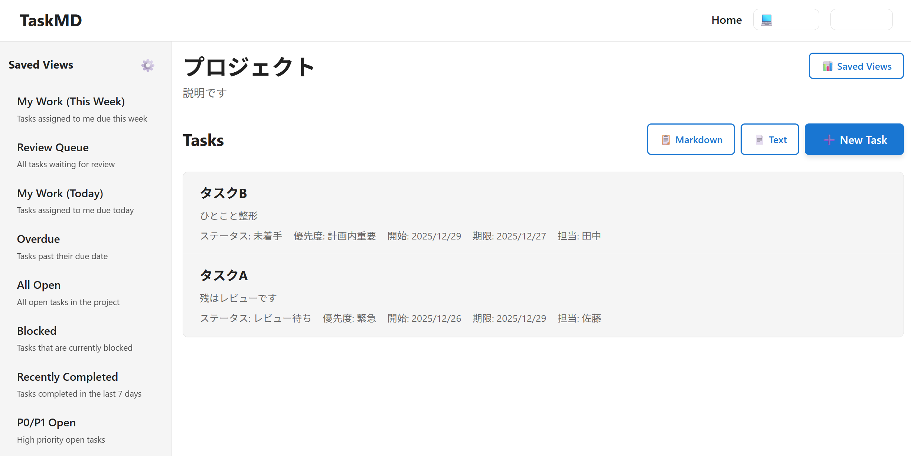
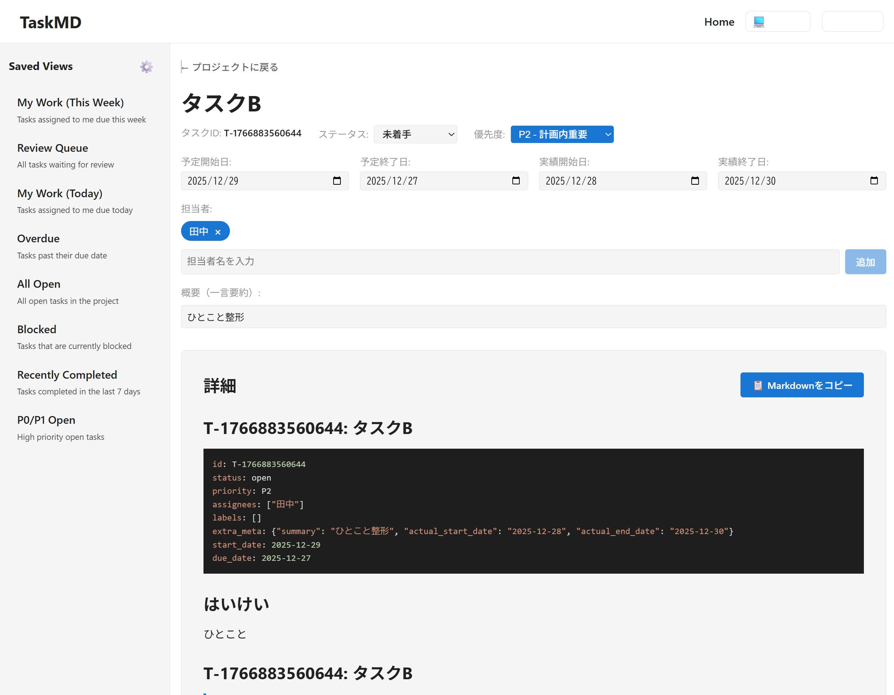

# TaskMD - AI協業に最適化されたMarkdownタスク管理

**TaskMD**は、Markdownでタスクを管理し、AIに引き渡しやすい形式で情報を出力できるタスク管理システムです。
タスク本文はMarkdown原文のまま保存され、担当者・期間・優先度・ステータスで瞬時に絞り込み、お気に入りビュー（Saved View）で一発表示。
さらに、AI向けに最適化された**Task Pack**をボタン一つで生成できます。

## 主な特徴

### 📝 Markdownファースト
- タスク本文をMarkdown原文のまま保存
- YAMLフロントマターでメタデータ管理
- Markdown記法をそのまま活用（見出し、リスト、コードブロック、折りたたみなど）

### 🔍 強力な絞り込み機能
- ステータス、優先度、担当者、ラベル、日付範囲で複合フィルタ
- Saved Viewで頻繁に使う条件を保存
- サイドバーから即座に切り替え

### 🤖 AI協業機能（Task Pack）
- 4種類のテンプレート（実装、バグ修正、調査、レビュー）
- タスク情報をAI向けに最適化して一括出力
- ワンクリックでクリップボードにコピー

### 📋 柔軟なコピー機能
- Markdown形式でタスクをコピー
- テキスト形式で整形してコピー
- プロジェクト単位、ビュー単位で一括コピー

## スクリーンショット

### プロジェクト一覧


タスク一覧画面では、ステータスや優先度を日本語で表示。概要（一言要約）も一目で確認できます。

### タスク詳細


タスク詳細画面では、Markdownをハイライト表示で編集でき、プレビューでは読みやすく整形されて表示されます。

## クイックスタート

### 前提条件

- Docker & Docker Compose
- （開発時）Go 1.22+, Node.js 20+

### 3ステップで起動

```bash
# 1. 環境変数を設定
cp .env.example .env
# .envファイルを編集してDB_PASSWORDを設定

# 2. データベースを初期化（サンプルデータ込み）
./db/init.sh --seed

# 3. すべてのサービスを起動
make up
# または: docker compose up -d
```

起動後のアクセス先：
- **Web UI**: http://localhost
- **API**: http://localhost:8080
- **Database**: localhost:5432

### よく使うコマンド

```bash
make help              # すべてのコマンドを表示
make logs              # ログを確認
make status            # サービスのステータス確認
make health            # ヘルスチェック
make down              # すべてのサービスを停止
```

## 使い方

### タスクの作成

1. プロジェクト一覧から対象プロジェクトを選択
2. 「➕ New Task」ボタンをクリック
3. タイトル、ステータス、優先度などを入力
4. Markdown本文に詳細を記述
5. 「作成」ボタンで保存

### Saved Viewの活用

1. タスク一覧画面で条件を設定（ステータス、優先度など）
2. 「📊 Saved Views」ボタンをクリック
3. 「新規ビュー作成」でフィルター条件を設定
4. ビュー名をつけて保存
5. サイドバーから保存したビューをワンクリックで呼び出し

### Task Packの生成

1. タスク一覧またはSaved Viewを表示
2. 「📦 Task Pack」ボタンをクリック
3. 用途に応じたテンプレートを選択：
   - **🔨 実装タスク**: 新機能実装や機能追加向け
   - **🐛 バグ修正**: バグ修正向け
   - **🔍 調査・研究**: 技術調査や分析向け
   - **👀 レビュー**: コードレビュー向け
4. 生成されたMarkdownが自動的にクリップボードにコピーされる
5. AIツール（Claude、ChatGPTなど）に貼り付けて利用

### タスクのコピー

- **📋 Markdownボタン**: タスク情報をMarkdown形式でコピー
- **📄 Textボタン**: 以下の形式で整形してコピー
  ```
  ■プロジェクト名
  ・タスク名 【ステータス】2025/12/26-2025/12/29 担当: 担当者
  　⇒概要（一言要約）
  ```

## 技術スタック

### フロントエンド
- **React 18** + TypeScript
- **TanStack Query (React Query)** - データフェッチング
- **React Router** - ルーティング
- **React Markdown** - Markdownレンダリング
- **i18next** - 多言語対応（日本語・英語）

### バックエンド
- **Go 1.22** - APIサーバー
- **Gin** - Webフレームワーク
- **PostgreSQL 16** - データベース
- **Meilisearch** - 全文検索（オプション）

### インフラ
- **Docker Compose** - ローカル開発環境
- **Cloud Run** - 本番環境（予定）

## プロジェクト構成

```
markdown-task-board/
├── taskmd-server/          # Go APIサーバー
│   ├── cmd/server/         # エントリーポイント
│   ├── internal/
│   │   ├── api/            # HTTPハンドラー
│   │   ├── models/         # データモデル
│   │   ├── repository/     # データアクセス層
│   │   ├── service/        # ビジネスロジック
│   │   ├── parser/         # Markdownパーサー
│   │   └── query/          # クエリビルダー
│   └── migrations/         # DBマイグレーション
├── taskmd-web/             # React Webアプリ
│   ├── src/
│   │   ├── components/     # Reactコンポーネント
│   │   ├── pages/          # ページコンポーネント
│   │   ├── hooks/          # カスタムフック
│   │   ├── lib/            # ユーティリティ
│   │   └── i18n/           # 多言語リソース
│   └── public/
├── db/                     # データベース
│   ├── migrations/         # スキーマ定義
│   └── seeds/              # サンプルデータ
└── docker-compose.yml      # Docker構成
```

## 開発情報

### ローカル開発

```bash
# バックエンド
cd taskmd-server
go run cmd/server/main.go

# フロントエンド
cd taskmd-web
npm install
npm run dev
```

### テスト

```bash
# バックエンド
cd taskmd-server
go test ./...

# フロントエンド
cd taskmd-web
npm test
```

## 機能詳細

### ステータス（進行度）
- **未着手** (open): タスクが開始されていない状態
- **進行中** (in_progress): 作業中
- **レビュー待ち** (review): レビューや確認待ち
- **ブロック中** (blocked): 進行不能な状態
- **完了** (done): 作業完了
- **アーカイブ** (archived): 保管済み（通常は非表示）

### 優先度
- **P0**: 緊急 - 即座に対応が必要
- **P1**: 今すぐ重要 - 最優先で取り組むべき
- **P2**: 計画内重要 - 計画的に対応
- **P3**: 余裕があれば - 時間がある時に対応
- **P4**: いつか - 将来的に検討

### Saved Viewクエリ仕様

基本的なフィルタリング構文：

```
# 基本形
status:open                    # 単一値
status:(open in_progress)      # 複数値（OR）
priority:P0 status:open        # 複合条件（AND）

# 日付範囲
start_date:>=2025-01-01       # 開始日が2025年1月1日以降
due_date:<=2025-12-31         # 期限が2025年12月31日まで

# 担当者
assignees:user1               # 特定ユーザー
assignees:(user1 user2)       # 複数ユーザー
```

## ライセンス

MIT License

## 貢献

Issue、Pull Requestを歓迎します。

## 詳細仕様

より詳細な仕様については、以下を参照してください：

- [データベース設計](./db/README.md)
- [バックエンドAPI仕様](./taskmd-server/README.md)
- [フロントエンド設計](./taskmd-web/README.md)
- [クラウド/インフラ設計](./CLOUD.md)

---

**TaskMD** - Markdown-first task management with AI handoff support
